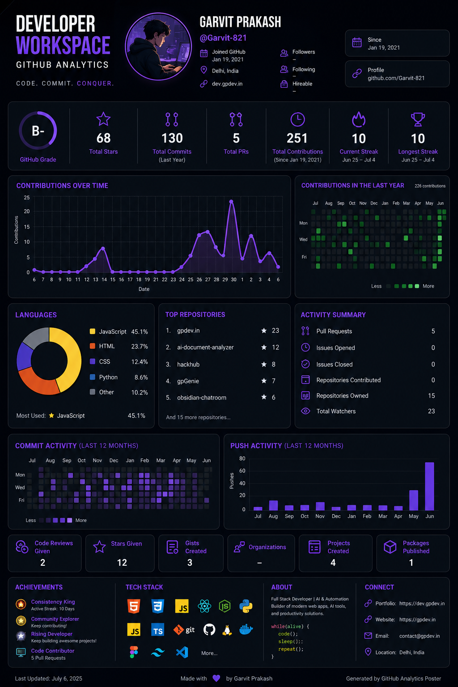

# GitCrib & StatPrint Engine

> High-performance, modular developer career blueprint and infographic engine generated dynamically via SVG/PDF for GitHub profile READMEs and social sharing.



GitCrib is an open-source data-infographic poster and banner creator designed to run fully inside the **Vercel Edge Runtime** using TypeScript, Preact, and zero external rendering engines. It ingests dense GitHub payloads and translates metrics into highly structured, glassmorphic technical blueprints with zero layout overlapping.

---

## 🚀 Key Features

*   **Multi-Aspect Coordinate Compositor**: Grid layouts adapt dynamically based on chosen target viewport dimensions:
    *   `Instagram Post` (1080x1080) - Condensed 2x4 row card layout
    *   `Instagram Portrait` (1080x1350) - Balanced 2x6 card wrap
    *   `Twitter Post` (1600x900) - 3-panel horizontal widescreen split
    *   `Poster / A4` (1200x1600) - High-density 8-row technical blueprint grid
    *   `4K / 8K Wallpaper` (3840x2160) - Side-by-side expanded group panels
    *   `Mobile Wallpaper` (1080x2400) - Single-column vertical scrolling stack
*   **Math-Driven Vector Charts**: Built-in coordinates mapping that bypasses heavyweight layout frameworks:
    *   *Line Charts*: Bezier cubic curve paths (`d="M... C..."`) tracking contribution histories.
    *   *Bar Charts*: Commits mapped to absolute scaled `<rect>` bars.
    *   *Donut Charts*: Trigonometric arc calculation (`Math.sin`, `Math.cos`) plotting languages.
    *   *Radar Charts*: Equidistant geometric angular skills projection plotting.
    *   *Dual Heatmap Grids*: Renders both the classic GitHub green heatmap (Row 3) and a theme-colored heatmap (Row 5) to visualize commit and contribution frequency.
*   **Compact Metrics Cards**: Layout presents 7 side-by-side metrics widgets (Grade, Stars, Commits, PRs, Contributions, and Current/Longest Streaks) aligned horizontally to conserve layout height.
*   **Achievement & Rank Badges**: Automatic evaluation of 13 gold, silver, and bronze level badges (e.g. Consistency King, Polyglot Developer, Night Owl, PR Master) displayed in a custom vertical sidebar column.
*   **Tech Stack Detection Matrix**: Scans public repositories, descriptions, and topics to detect and display tech badge layers (React, Next, Vue, Rust, FastAPI, Docker, and more).
*   **Graphics & Export Layers**: Native handlers for `renderToSVG()` (raw responsive SVG string), `renderToCanvas()` (HTML5 canvas drawers for JPG/PNG exports), and `renderToPDF()` (lightweight binary PDF streams).

---

## 🛠️ Local Development

### Prerequisites
*   Node.js (v18+)
*   npm

### Setup
1. Clone the repository and install dependencies:
   ```bash
   git clone https://github.com/Garvit-821/GitCrib.git
   cd GitCrib
   npm install
   ```

2. Compile TypeScript:
   ```bash
   npm run build
   ```

3. Launch the development server:
   ```bash
   node server.js
   ```
   Open [http://localhost:3000](http://localhost:3000) to view the interactive landing page.

---

## 🧪 Verification & Testing

Verify the engine modules, aspect ratios, achievement calculations, and canvas drawing contexts using the test scripts:

```bash
# Compile and run the StatPrint Engine verification suite
npm run build && node dist/engine/test.js

# Run integration tests against the local server
node test.js
```

---

## 🔌 API Query Parameters

Customize your blueprint embeds using URL query parameters:

| Parameter | Type | Description | Values |
| :--- | :--- | :--- | :--- |
| `username` | `string` | **Required**. GitHub username to fetch. | e.g. `Garvit-821` |
| `theme` | `string` | Visual aesthetic color palette. | `blueprint`, `cyberpunk`, `matrix`, `amber` |
| `layout` | `string` | Viewport aspect ratio preset. | `poster`, `banner` |
| `devClass` | `string` | Override the computed developer title. | e.g. `Systems Architect` |
| `stars` | `number` | Override total stars display. | e.g. `500` |

---

## ⚡ Deployment

### Live Instance
You can access the live instance of GitCrib at: [https://git-crib.vercel.app/](https://git-crib.vercel.app/)

### Vercel Deployment (Coming Soon)
A one-click deploy button to run your own instance of the GitCrib API on Vercel Serverless/Edge functions will be available soon.

---

## 🤝 Contributing

Contributions make the open-source community an amazing place to learn, inspire, and create. Any contributions you make are **greatly appreciated**.

If you want to contribute:
1. **Fork** the Project.
2. Create your **Feature Branch** (`git checkout -b feature/AmazingFeature`).
3. **Commit** your Changes (`git commit -m 'Add some AmazingFeature'`).
4. **Push** to the Branch (`git push origin feature/AmazingFeature`).
5. Open a **Pull Request**.

Feel free to open issues to report bugs, suggest features, or request new theme/layout configurations!

---

## 📖 The Error Book

A record of technical challenges faced during development and the engineering solutions implemented:

### 1. GitHub API Rate Limiting (403 Forbidden)
*   **Symptom/Cause**: Direct calls to GitHub REST endpoints (profile stats, commit search) return `403 Forbidden` under high traffic due to strict IP rate limits.
*   **Solution**: Implemented regex-based HTML parsers (`scrapeGithubProfile` and `fetchContributionCalendar` in `api/index.ts`) as fallbacks. If the REST API fails, the server fetches the public profile pages and extracts user stats, language splits, and the daily contribution calendar grid without API credentials.

### 2. Broken Avatar Images in SVG Embeds
*   **Symptom/Cause**: When loading the generated SVG within an HTML `` tag, the browser blocks all external sub-requests (such as loading the avatar image URL from `https://avatars.githubusercontent.com/...`) due to SVG security containment policies.
*   **Solution**: Implemented a server-side base64 image compiler (`fetchAvatarAsBase64` in `api/index.ts`). The server fetches the avatar image, encodes it into a Base64 data URI (`data:image/...;base64,...`), and embeds it directly into the SVG’s `<image>` tag.

### 3. Text Overlap in Header Blocks
*   **Symptom/Cause**: Long usernames, extensive custom developer class names, or verbose biography text overlapped horizontally with the metadata columns (`Location`, `Website`, `Profile`).
*   **Solution**: Refined `ProfileHeader` in `components/DataBlocks.tsx` to:
    *   Split the username (`@username`) and developer title (`devClass`) into separate stacked lines.
    *   Implement a helper function to wrap long bios into multi-line strings (max 32 chars per line).
    *   Shifted the metadata columns further to the right (`Column 1` to `x = 810`, `Column 2` to `x = 980`) to expand clearance.

### 4. Nesting Template Literals & TypeScript Compile Breaks
*   **Symptom/Cause**: Nested backticks (`` ` ``) and string interpolation markers (`${}`) inside client-side JS scripts broke string matching and triggered compilation errors inside the parent landing page template string literal.
*   **Solution**: Escaped all nested template literal elements (e.g., as `` \`image/\${format}\` ``) in `components/LandingPage.ts` to keep the TypeScript compiler and edge builder happy.

---

## 📄 License
This project is licensed under the MIT License - see the [LICENSE](LICENSE) file for details.


<!-- doc-updates-marker -->
### 🛠️ Documentation Version History
*   **v1.0.1**: Improve typography in features section.
